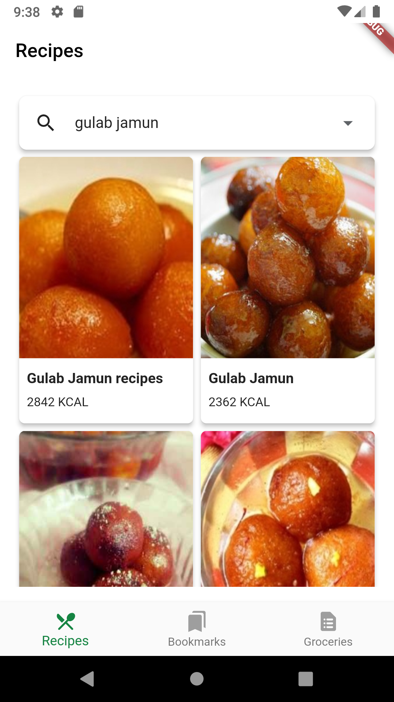
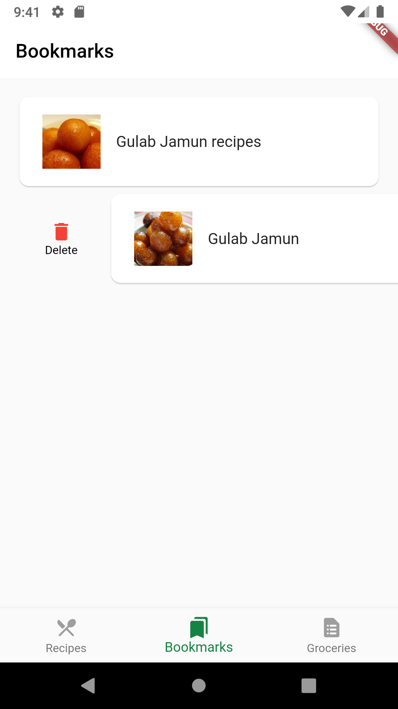
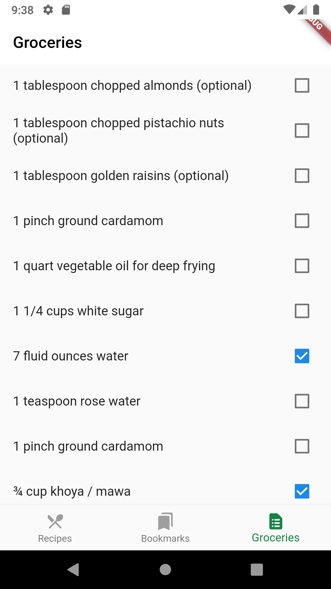

# Recipe Finder

This is a Flutter project called "Recipe Finder", which as the name suggests, finds recipes based on input search text. The recipes can be bookmarked and required groceries for the bookmarked recipe will be listed.

&nbsp;

The recipes are searched using Recipe Search API from https://www.edamam.com/.

If you are running this app, please add your apiKey and apiId in lib/network/recipe_service.dart.

apiKey and apiId are obtained by creating an application in https:www.edamam.com

 

This project is described in the Flutter Apprentice Book on www.raywenderlich.com

Link for the Book: https://www.raywenderlich.com/books/flutter-apprentice

GitHub link for the book materials: https://github.com/raywenderlich/flta-materials

` `  
` `  
Screenshots of the app are attached here :

<!-- |||| -->
|__Splash Screen__|__Search Recipes__|__Selected Recipe__|
|-----------------|------------------|-------------------|
||||
|__Bookmarks__|__Groceries__|
|||
